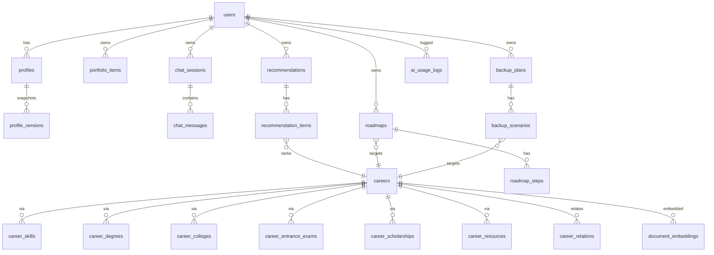
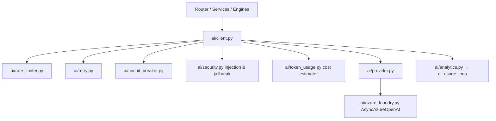
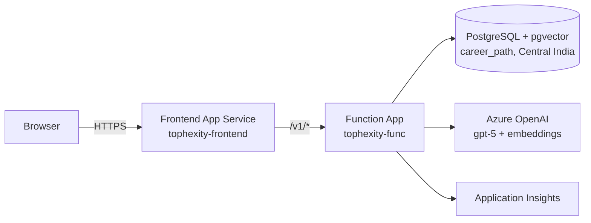
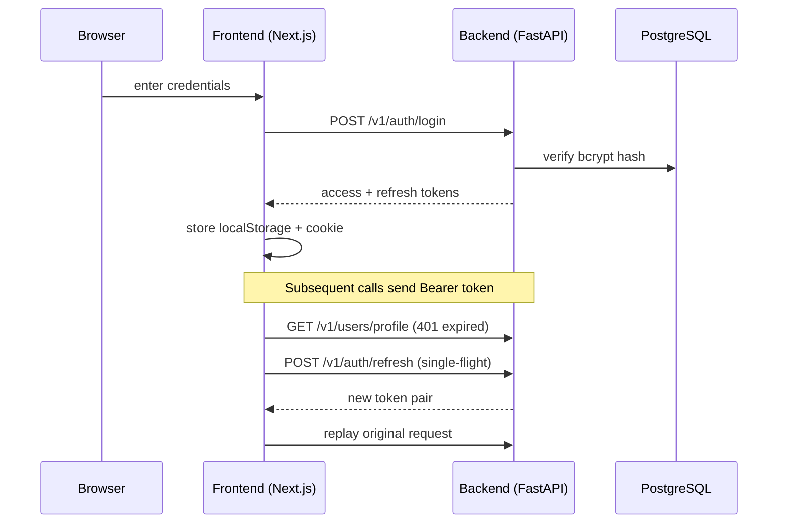
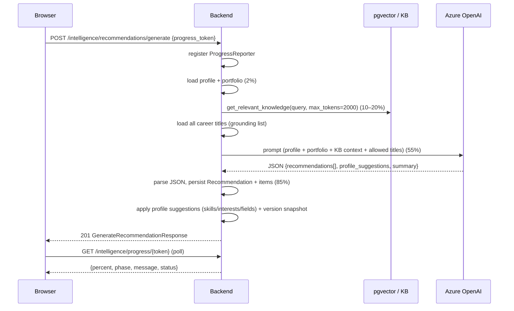
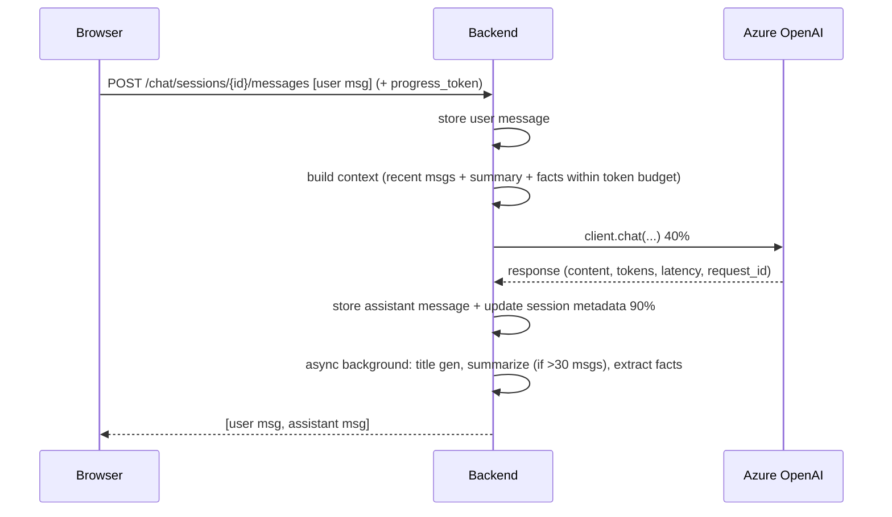
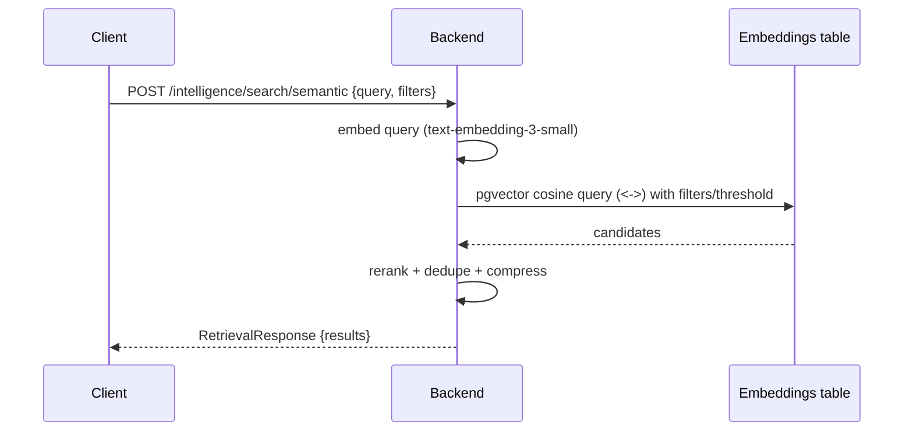

# AI Career Path Creator — Technical Report

**Version 0.1.0** · Prepared for the Hack4Hyd presentation

This document is a comprehensive technical report of the **AI Career Path Creator** platform. It covers the full stack: frontend, backend, database, AI/RAG layer, cloud infrastructure, API surface, key flows, implementation highlights, a live demo guide, and presentation notes. All facts are sourced from the repository under `C:\DefaultStuff\hack4hyd`.

---

## Table of Contents

1. [Project Overview](#1-project-overview)
2. [Frontend Architecture](#2-frontend-architecture)
3. [Backend Architecture](#3-backend-architecture)
4. [Database Schema & Migrations](#4-database-schema--migrations)
5. [AI System](#5-ai-system)
6. [Knowledge Base & RAG](#6-knowledge-base--rag)
7. [Cloud Infrastructure](#7-cloud-infrastructure)
8. [API Endpoint Table](#8-api-endpoint-table)
9. [Key Flows](#9-key-flows)
10. [Implementation Highlights](#10-implementation-highlights)
11. [Demo Guide](#11-demo-guide)
12. [Presentation Notes](#12-presentation-notes)

---

## 1. Project Overview

**AI Career Path Creator** is an AI-powered career guidance platform. It ingests a rich research knowledge base — currently **540 careers** linked to **4,782 skills, 1,822 degrees, 1,001 colleges, 451 entrance exams, and 1,135 scholarships** — lets users build a structured profile and portfolio, and then uses Azure OpenAI to generate:

- **Personalized career recommendations** with match scores and per-career reasoning,
- **Learning roadmaps** with phased milestones and resources,
- **Backup plans** with alternative career scenarios and transition difficulty,
- A **conversational career advisor** (chat) with long-term memory, summarization, and fact extraction.

### Goals

1. Recommend careers grounded in *real* knowledge-base data (no hallucinated titles).
2. Ground AI answers with retrieval-augmented generation (pgvector semantic search).
3. Make every long-running AI operation observable (phase progress, tokens, latency, cost).
4. Stay resilient under load: retries, multi-window rate limiting, circuit breaker.

### Tech stack at a glance

| Layer        | Technology |
|--------------|-----------|
| Frontend     | Next.js 16.2.11 (App Router), React 19.2.4, TypeScript 5, Tailwind CSS v4, axios, framer-motion, lucide-react |
| Backend      | Python 3, FastAPI, SQLAlchemy 2 (async), Pydantic v2, uvicorn |
| Hosting      | Azure Functions (Python) via an HTTP bridge, Azure App Service (Node) for frontend |
| Database     | Azure Database for PostgreSQL (flexible server, Central India), `pgvector` extension |
| AI           | Azure OpenAI (Azure AI Foundry project) — gpt-5 chat deployment + text-embedding-3-small |
| Migrations   | Alembic |
| Tests        | pytest (`tests/`, 16 test modules) |

### Live endpoints

- Backend API: `https://tophexity-func.azurewebsites.net` (Swagger at `/docs`)
- Frontend: `https://tophexity-frontend.azurewebsites.net`

### Repository layout

```
C:\DefaultStuff\hack4hyd\
├── app\                      # FastAPI backend
│   ├── api\v1\               # 12 routers
│   ├── core\                 # config, database, security, logging, startup validation
│   ├── middleware\           # request timing
│   ├── models\               # SQLAlchemy models (13 modules)
│   ├── schemas\              # Pydantic request/response models
│   ├── services\             # domain services + engines
│   │   └── ai\               # AI client, resilience, prompts, memory, analytics
│   └── utils\                # exception hierarchy
├── alembic\                  # 6 migrations
├── Tophexity-Frontend\       # Next.js app
├── tests\                    # pytest suite
├── scripts\                  # seed/import/embedding/audit tooling
├── rdocs\                    # source career research data (CSV/TSV)
├── dummy_data\               # seed JSON
├── docs\                     # developer documentation (18 files)
├── function_app.py           # Azure Functions entry (FastAPI bridge)
├── requirements.txt
├── host.json
├── do_deploy.ps1
└── .env                      # config (keys not reproduced here)
```

---

## 2. Frontend Architecture

Located in `Tophexity-Frontend/`. A modern App-Router Next.js application with Turbopack, styled with Tailwind CSS v4.

### Stack

- **Next.js 16.2.11** (`next start -p ${PORT:-8080}`, standalone output used for Azure deployment)
- **React 19.2.4**, **TypeScript 5**
- **axios** (`^1.18.1`) for API calls, **framer-motion** for animations, **lucide-react** for icons, **clsx** for class composition

### Pages (App Router)

| Route | Purpose |
|-------|---------|
| `/` | Landing page |
| `/(auth)/login`, `/(auth)/register`, `/(auth)/forgot-password`, `/(auth)/reset-password` | Auth flows |
| `/dashboard` | User dashboard |
| `/profile` | Profile view/edit + version history |
| `/careers` | Career explorer (browse/filter/search from knowledge base) |
| `/careers/admin` | Career admin (create/edit/delete + bulk import) |
| `/portfolio` | Portfolio items CRUD |
| `/recommendations` + `/recommendations/[id]` | Generate + view recommendation sets |
| `/roadmaps` + `/roadmaps/[id]` | Generate + view learning roadmaps (timeline) |
| `/backups` + `/backups/[id]` | Generate + view backup plans |
| `/chat` | AI career chat with sessions |
| `/settings` | Theme + navigation customization |

### Component structure

- **Shell**: `AppShell.tsx` (renders sidebar for all routes except `/login`, `/register`, `/`; full-height for `/chat`), `nav/Sidebar.tsx`, `nav/SidebarItem.tsx`
- **UI kit** (`components/ui/`): `Button`, `Card`, `Input`, `Select`, `Modal`, `Tabs`, `Checkbox`, `Slider`, `TagInput`, `ProgressBar`, `GenerationProgress`, `AvatarPicker`
- **Feature components**: `careers/` (Card, Filters, DetailModal), `chat/` (Sidebar, Area, Message, StatsCard, ExportModal), `profile/`, `portfolio/`, `recommendations/`, `roadmaps/` (Timeline), `backups/`, `settings/` (SettingsForm, NavCustomizer), `auth/`
- **Contexts**: `AuthContext`, `SettingsContext`, `ProfileContext`, `ToastContext`; plus `ThemeProvider`, `ErrorBoundary`, `Providers`
- **Hooks**: `useAuthInit`, `useGenerationProgress`, `useFavorites`, `usePageTitle`
- **Types**: per-domain types in `src/types/` (auth, profile, career, portfolio, recommendation, roadmap, backup, chat, settings, common)

### API client (`src/lib/api.ts`)

- Single axios instance with `baseURL: "/v1"` and a **300 s timeout** (AI operations are slow).
- Bearer token injected from `localStorage` (`access_token`).
- **Single-flight token refresh**: on a 401 the interceptor queues concurrent requests, refreshes once via `/auth/refresh`, replays the queue; on failure clears tokens and redirects to `/login`.
- Token persistence: `localStorage` keys `access_token`, `refresh_token`, `user_id`, `email` plus an `access_token` cookie (30 min, SameSite=Lax).
- Exposes typed helpers for every backend group (auth, profile, careers, portfolio, recommendations, roadmaps, backups, chat, intelligence/progress).

### Settings (`src/types/settings.ts`, `SettingsContext.tsx`)

- Persisted under `localStorage["tophexity_settings"]`.
- `UserSettings` = `{ navItems: NavItem[], theme }` — theme and nav-item visibility only; saves are immediate (no server-side settings, no notification toggles — those were intentionally removed).

### Generation progress UX

- `useGenerationProgress.ts` polls `GET /v1/intelligence/progress/{token}` — first poll at 300 ms, then every **1.5 s** — and drives the `GenerationProgress` bar with phase/message/percent/status.
- Because generation is **non-streaming**, the frontend shows live phase feedback instead of a spinner.

---

## 3. Backend Architecture

FastAPI application packaged for Azure Functions.

### Request path

```
Azure Function (HTTP trigger, catch-all "{*path}")
  └─ function_app.py  →  httpx.AsyncClient(ASGITransport(fastapi_app))
        └─ app/main.py (FastAPI)  →  RequestTimingMiddleware  →  CORS  →  /v1 routers
```

- `function_app.py` (`app = func.FunctionApp(http_auth_level=func.AuthLevel.ANONYMOUS)`) registers a single `@app.route(route="{*path}", methods=[...])` handler that forwards the raw method/headers/body through `ASGITransport` into the FastAPI app with a **300 s timeout**. The `host` and `x-azure-ref` headers are stripped; `content-length`/`content-type` are removed from the response to let Azure Functions set them.
- `app/main.py::create_app()` sets `docs_url="/docs"`, `redoc_url="/redoc"`, CORS (allow_origins from settings), and a `lifespan` that:
  1. configures structured logging,
  2. runs `validate_on_startup()`,
  3. initializes the AI client (logs 503 if unconfigured),
  4. **warms the prompt cache** for every registered prompt.
- Root routes: `GET /health`, `GET /health/ai`.

### Core modules (`app/core/`)

| Module | Responsibility |
|--------|----------------|
| `config.py` | Pydantic-settings `Settings`; reads `.env`; supports `OPENAI_*`/`AZURE_OPENAI_*` env aliases; falls back to `api_key.txt` for the AI key; cached via `@lru_cache` |
| `database.py` | Async engine (asyncpg), pool_size=5 / max_overflow=10, `pool_pre_ping=True`; `get_db` yields an auto-commit/auto-rollback session |
| `security.py` | bcrypt hashing (passlib) and JWT (python-jose, HS256) for access, refresh, and password-reset tokens |
| `logging.py` / `structured_logging.py` | Leveled logging + optional JSON-mode structured logging |
| `startup_validation.py` | Validates required config on boot |
| `middleware/timing.py` | Request timing middleware |

### API layer (`app/api/v1/`)

- `router.py` composes 12 routers under prefix `/v1`.
- `deps.py`: `get_current_active_user` (Bearer JWT with `type == "access"`, active-user check), `get_db_session`.
- `utils/exceptions.py`: `AppException` hierarchy + `safe_flush()` which maps `IntegrityError` → 409/400 with a rollback.

### Engines & services (`app/services/`)

| Service | Purpose |
|---------|---------|
| `auth_service.py` | register/login/refresh/password reset, token creation |
| `profile_service.py` | profile CRUD + automatic `ProfileVersion` snapshots on update |
| `portfolio_service.py` | portfolio items CRUD (soft-delete) |
| `career_service.py` | search/filter, bulk import, detail with relations, update/delete |
| `recommendation_service.py` / `recommendation_engine.py` | store + **AI generation** of recommendation sets |
| `roadmap_service.py` / `roadmap_engine.py` | store + AI roadmap generation |
| `backup_service.py` / `backup_engine.py` | store + AI backup-plan generation |
| `chat_service.py` | chat sessions/messages CRUD, export (json/markdown/text), stats |
| `knowledge_base_service.py` | browse/search all KB entities + stats |
| `embedding_service.py` | chunk embedding pipeline (see §6) |
| `retrieval_engine.py` | pgvector semantic/hybrid retrieval, rerank/dedup/compress (see §6) |
| `chunking.py` | per-source-type text chunkers (512-char) |
| `progress_store.py` | in-memory `ProgressStore` (TTL 900 s, token-keyed) + `ProgressReporter` |
| `ai/` | the full AI subsystem (see §5) |

`ai_client.py` and `recommendation_client.py` at the top service level are legacy stubs — the live client lives in `app/services/ai/client.py`.

### Dependencies (`requirements.txt`)

`fastapi`, `uvicorn`, `pydantic` v2 + `pydantic-settings`, `sqlalchemy` v2 (async), `asyncpg`, `alembic`, `python-jose[cryptography]`, `passlib[bcrypt]`, `httpx`, `openai >= 1.50`, `azure-functions`, `pgvector`, `numpy`.

---

## 4. Database Schema & Migrations

**PostgreSQL** (Azure flexible server, Central India), database `career_path`, with the **pgvector** extension for embeddings. All primary keys are UUIDv4 (via `UUIDPrimaryKeyMixin`); `TimestampMixin` provides `created_at`/`updated_at`; `SoftDeleteMixin` provides `deleted_at`.

### Tables

#### Users & profile
| Table | Notes |
|-------|-------|
| `users` | email (unique), `hashed_password`, `is_active`, `is_verified`, `role` (user/admin), soft-delete |
| `profiles` | one-per-user; education level, years of experience, current/target fields, skills/interests (JSON), bio, avatar |
| `profile_versions` | immutable snapshots with `version_number` (created on every profile update) |

#### Portfolio
| Table | Notes |
|-------|-------|
| `portfolio_items` | title, description, url, `item_type` (project, hackathon, competition, certificate, research, internship, olympiad, leadership, volunteering, achievement, …), `skills_used` JSON, soft-delete |

#### Knowledge base (careers graph)
| Table | Notes |
|-------|-------|
| `careers` | title (unique), description, salary tiers (average/entry/mid/senior/highest), growth outlook, demand level, category, industry, work environment, weekly hours, travel, stress, work-life balance, automation risk, `metadata` JSONB |
| `skills`, `degrees`, `colleges`, `entrance_exams`, `scholarships`, `resources` | shared entity tables |
| `career_skills`, `career_degrees`, `career_colleges`, `career_entrance_exams`, `career_scholarships`, `career_resources` | junction tables with per-link metadata (`level`, `is_required`, `program_name`, …), CASCADE on career |
| `career_relations` | self-referencing career graph: `related` / `alternative` / `prerequisite` / `supplementary` |

#### User outcomes
| Table | Notes |
|-------|-------|
| `recommendations` / `recommendation_items` | header + ranked items (career_id, `match_score` 0–100, `rank`, reasoning JSON with strengths/weaknesses/missing skills/degrees/colleges/certs) |
| `roadmaps` / `roadmap_steps` | header (career_id, status active/completed/archived, `estimated_duration_months`) + ordered steps (duration, resources JSON) |
| `backup_plans` / `backup_scenarios` | header + scenarios (career_id, transition difficulty, estimated months, reasoning) |

#### Chat platform
| Table | Notes |
|-------|-------|
| `chat_sessions` | title, lifecycle (`is_archived`, `archived_at`, `is_pinned`, `pinned_at`), AI memory (`summary`, `summary_updated_at`, `summary_message_count`), `session_data` JSONB (message_count, total_tokens, last_model, facts) |
| `chat_messages` | role, content, `token_count`, `model_used`, `latency_ms`, `request_id`, `message_data` JSONB (finish_reason, prompt/completion tokens) |

#### AI analytics & embeddings
| Table | Notes |
|-------|-------|
| `document_embeddings` | `source_id`, `source_type`, `chunk_index`, `chunk_text`, `embedding Vector(1536)`, `metadata` JSONB, `version`, `content_hash`; indexed (source_type, source_id), (…, version), content_hash |
| `embedding_jobs` | background rebuild jobs: status, total/processed/failed items, error message, timestamps |
| `ai_usage_logs` | every AI call: request_id (unique), user/conversation, model/deployment, tokens, `estimated_cost_usd`, latency, prompt name/version, status, retry_count, injection/jailbreak flags |
| `ai_health_snapshots` | periodic health checks: azure_connected, deployment_available, auth_valid, latency, model, error |

### ER overview



### Migrations (`alembic/versions/`)

1. `21039be197ed_initial_schema.py` (~30 KB) — full initial schema
2. `3a589c75e389_add_knowledge_base_columns_to_careers.py` — KB extended fields (salaries, work data, automation risk, metadata)
3. `7dd0e554f9fc_update_fk_delete_behaviors.py` — FK on-delete refinements
4. `b842f67cd677_add_document_embeddings_and_embedding_*.py` — `document_embeddings` + `embedding_jobs`
5. `e1a2b3c4d5f6_enhance_chat_tables.py` — chat lifecycle + memory columns, JSONB `session_data`
6. `f4a1b2c3d4e5_add_ai_analytics_tables.py` — `ai_usage_logs`, `ai_health_snapshots`

---

## 5. AI System

All AI traffic flows through a single client in `app/services/ai/client.py` — the only choke point where resilience, safety, and analytics are applied.

### Configuration (from `app/core/config.py` / `.env`)

- Endpoint: `https://tophex.cognitiveservices.azure.com/`, deployment `gpt-5`, API version `2024-12-01-preview`
- AI Foundry project URL: `https://tophex.services.ai.azure.com/api/projects/proj-tophex`
- `AI_MAX_TOKENS = 16384`, `AI_TEMPERATURE = 0.7`, `AI_MAX_INPUT_TOKENS = 32000`
- Request timeout 300 s; max retries 3 with base delay 1 s / max delay 30 s (exponential backoff + jitter)

### Architecture



### Resilience layer

| Concern | Implementation |
|---------|----------------|
| Retries | Exponential backoff + jitter; max 3 attempts |
| Rate limiting | Multi-window sliding buckets: 50/min, 500/hour global; 25/user/min; 5000/user/day; 60/IP/min; 30/conversation/min |
| Circuit breaker | CLOSED → OPEN after 10 consecutive failures, 90 s cooldown, HALF-OPEN probes; state exposed via admin API |
| Error mapping | `ai/exceptions.py` → HTTP 500/503/504/429/502 with safe messages |

### Prompt framework

- `prompt_loader.py`: loads templates with **frontmatter metadata** (version, description, variables) and `render_prompt(name, variables)`.
- `prompt_versioning.py`: versioned template directories (`v{N}.md` + `metadata.json`) so prompts are auditable.
- `prompt_cache.py`: in-memory cache, TTL 300 s, warmed at startup, admin-invalidatable.

### Conversation memory (`conversation_manager.py`, `memory.py`, `context_builder.py`, `summarizer.py`, `fact_extractor.py`)

- **Session lifecycle**: `chat_sessions` carries archive (`is_archived`/`archived_at`) and pin (`is_pinned`/`pinned_at`) state; retention/archive/max-session limits are configured in settings (retention 180 days, archive after 60 days, max 500 sessions/user) and auto **title generation** runs on the first message (5 s timeout).
- **Memory**: recent-message window + rolling AI **summary**; summarization triggers at `AI_SUMMARY_THRESHOLD_MESSAGES = 30`, keeping `AI_SUMMARY_KEEP_RECENT = 15`.
- **Fact extraction**: every 5 messages, extracts structured facts (7 categories) with deduplication, stored in `session_data`.
- **Context builder**: token-budgeted, priority-ordered assembly — system prompt 15% / summary 10% / facts 5% / messages 50% / response 20% of budget; `context_cache` TTL 60 s.
- Background maintenance (title/summary/facts) runs via `asyncio.create_task` *after* the response is stored, so it never blocks the user.

### Safety

- `ai/security.py`: regex-based **prompt-injection** and **jailbreak** detection + input sanitizer; applied as middleware on AI requests; every detection is persisted on the usage log.

### Observability

- `analytics.py`: writes one `ai_usage_logs` row per call (tokens, cost, latency, prompt version, status, retries, security flags).
- `monitoring.py`: `ai_health_snapshots` + `deep_health_check()` (DB connectivity, AI config, deployment, auth, latency).
- `health.py`: live AI health probe (`GET /health/ai`, `GET /v1/ai/health`).

---

## 6. Knowledge Base & RAG

### Source data

Researched career data lives in `rdocs/`: `careers_150_combined.csv` (~150 careers), `science_careers_research_100.csv` (~100 science careers), `careers_research_output.tsv`, plus a compiled research archive. Seeding is done by `scripts/import_knowledge_base.py`, `scripts/seed_data.py`, and `scripts/load_dummy_data.py`. The live knowledge base currently holds **540 careers, 4,782 skills, 1,822 degrees, 1,001 colleges, 451 entrance exams, and 1,135 scholarships** (verified via `GET /v1/knowledge-base/stats`).

### Career records

Each career carries rich structured fields (see §4): salary tiers, growth/demand, category/industry, work environment, weekly hours, travel, stress, work-life balance, automation risk, plus linked skills/degrees/colleges/exams/scholarships/resources and career-relation edges.

### Embedding pipeline

- `embedding_service.py` calls Azure **text-embedding-3-small** (1536 dims) directly over httpx.
- `chunking.py` produces per-source-type chunks (~512 characters).
- Batches of **8** with a **2.5 s** delay between batches (rate-limit friendliness).
- `document_embeddings` rows carry `content_hash` for idempotent rebuilds and a `version` field.
- `POST /v1/intelligence/embeddings/rebuild` starts a background `EmbeddingJob` (tracked in `embedding_jobs`, status via `GET /embeddings/jobs/{job_id}`); `GET /embeddings/status` reports coverage.

### Retrieval (`retrieval_engine.py`)

- **Semantic search**: pgvector cosine similarity with source-type filters, `top_k`, score threshold, and metadata filters.
- **Hybrid search**: combines semantic + keyword scoring.
- **Post-processing**: rerank, deduplicate, and **compress** context to fit token budgets (`get_relevant_knowledge(db, query, max_tokens=…)`).
- **Debug endpoint** (`/search/debug`): returns per-result scores and timing for tuning.

### Consumption

The recommendation engine builds a search query from profile + portfolio, retrieves KB context via `get_relevant_knowledge`, and constrains the model to the **exact career titles present in the database** — the model cannot invent careers.

---

## 7. Cloud Infrastructure



### Components

| Resource | Type | Notes |
|----------|------|-------|
| `tophexity-func` | Azure Functions (Python) | hosts FastAPI via ASGI bridge; route prefix disabled (`routePrefix: ""`), extension bundle `[4.*, 5.0.0)`, App Insights sampling (Requests excluded) |
| `tophexity-frontend` | App Service (Linux Node) | standalone Next.js, `next start -p ${PORT:-8080}` |
| `tophexity-pg…` | PostgreSQL flexible server | db `career_path`, `pgvector` extension, firewall rule `DevMachine` for local dev |
| Azure OpenAI | Cognitive Services `tophex` / Foundry project `proj-tophex` | gpt-5 chat deployment, text-embedding-3-small |

### Deployment

- **Backend**: `func azure functionapp publish tophexity-func --python --build remote` from a fresh staging directory (`app/`, `alembic/`, `function_app.py`, `requirements.txt`, `.env`, `api_key.txt`, `host.json`).
- **Frontend**: build `npm run build` → zip staging dir → `az webapp deployment source config-zip --name tophexity-frontend --resource-group tophexity-rg` (expect `RuntimeSuccessful`).
  - Ops note: with standalone output, `_next/static/` and `public/` must be present at **both** the app directory level and the top level of the zip (the `server.js` resolves `path.join(__dirname, …)` for both), because the runtime serves either layout.
- `do_deploy.ps1` packages backend artifacts into `deploy.zip` (used for manual archive; live publishes use the Azure Functions tooling).

### Environment configuration (`.env` keys, values omitted)

`APP_NAME`, `APP_VERSION`, `DEBUG`, `DATABASE_URL`, `DATABASE_ECHO`, `JWT_SECRET_KEY`, `JWT_ALGORITHM`, `JWT_ACCESS_TOKEN_EXPIRE_MINUTES`, `AI_ENDPOINT`, `AI_API_KEY`, `AI_DEPLOYMENT_NAME`, `AI_API_VERSION`, `AI_FOUNDRY_PROJECT_URL`, `AI_MAX_RETRIES`, `AI_RETRY_BASE_DELAY`, `AI_RETRY_MAX_DELAY`, `AI_REQUEST_TIMEOUT`, `AI_MAX_TOKENS`, `AI_TEMPERATURE`, `AI_RATE_LIMIT_PER_MINUTE`, `AI_RATE_LIMIT_PER_HOUR`, `AI_RATE_LIMIT_PER_USER_PER_MINUTE`, `AI_RATE_LIMIT_PER_IP_PER_MINUTE`, `AI_RATE_LIMIT_PER_CONVERSATION_PER_MINUTE`, `AI_SUMMARY_THRESHOLD_MESSAGES`, `AI_SUMMARY_KEEP_RECENT`, `AI_MAX_CONTEXT_MESSAGES`, `RECOMMENDATION_SERVICE_URL`, `CORS_ORIGINS`, `LOG_LEVEL`.

### Tests & tooling

- 16 pytest modules: auth, admin, ai, backup, career, chat, conversation platform, health, intelligence, memory, platform engineering, portfolio, profile, recommendation, roadmap.
- Scripts for data ops: `import_knowledge_base.py`, `seed_data.py`, `load_dummy_data.py`, `rebuild_embeddings.py`, `continue_embeddings.py`, `track/check_embeddings_progress.py`, `audit_data.py`, `db_health_summary.py`, `verify_migrations_tempdb.py`.
- Documentation: 18 Markdown guides in `docs/` (API references, AI architecture, prompt framework, security, monitoring, operations, integration).

---

## 8. API Endpoint Table

All routes are mounted under the `/v1` prefix. Auth-dependent endpoints use `Authorization: Bearer <access_token>`; knowledge base & career browse/detail endpoints are public.

### Auth — `/v1/auth`
| Method | Path | Summary |
|--------|------|---------|
| POST | `/auth/register` | Create account (email + password 8–128 chars) |
| POST | `/auth/login` | Login → access + refresh tokens |
| POST | `/auth/refresh` | Exchange refresh token for new pair |
| POST | `/auth/logout` | Discard tokens (client-side) |
| GET | `/auth/me` | Current user info |
| POST | `/auth/forgot-password` | Request reset token (always generic response) |
| POST | `/auth/reset-password` | Set new password (token expires in 15 min) |

### Users — `/v1/users`
| Method | Path | Summary |
|--------|------|---------|
| POST | `/users/profile` | Create profile (one per user) |
| GET | `/users/profile` | Get profile |
| PUT | `/users/profile` | Update profile (auto-creates version snapshot) |
| DELETE | `/users/profile` | Delete profile + versions |
| GET | `/users/profile/versions` | Version history |

### Portfolio — `/v1/portfolio`
| Method | Path | Summary |
|--------|------|---------|
| GET | `/portfolio/items` | List (paginated, filter by item_type) |
| POST | `/portfolio/items` | Create item |
| GET | `/portfolio/items/{item_id}` | Get item |
| PUT | `/portfolio/items/{item_id}` | Update item |
| DELETE | `/portfolio/items/{item_id}` | Soft-delete item |

### Careers — `/v1/careers`
| Method | Path | Summary |
|--------|------|---------|
| POST | `/careers/import` | Bulk import (skips duplicate titles) |
| GET | `/careers` | Search/filter careers (public) |
| GET | `/careers/{career_id}` | Full detail with relations (public) |
| PUT | `/careers/{career_id}` | Update basic fields |
| DELETE | `/careers/{career_id}` | Delete career + junctions |

### Knowledge Base — `/v1/knowledge-base`
| Method | Path | Summary |
|--------|------|---------|
| GET | `/knowledge-base/stats` | Entity counts + categories/industries |
| GET | `/knowledge-base/careers` | Advanced browse (category, industry, skill, degree, demand, salary, work environment) |
| GET | `/knowledge-base/careers/{career_id}` | Full detail incl. salary tiers & metadata |
| GET | `/knowledge-base/skills` | Search skills |
| GET | `/knowledge-base/degrees` | Search degrees |
| GET | `/knowledge-base/colleges` | Search colleges |
| GET | `/knowledge-base/entrance-exams` | Search exams |
| GET | `/knowledge-base/scholarships` | Search scholarships |

### Recommendations — `/v1/recommendations`
| Method | Path | Summary |
|--------|------|---------|
| POST | `/recommendations` | Store a recommendation set |
| GET | `/recommendations/history` | Paginated history |
| GET | `/recommendations/{recommendation_id}` | Detail with ranked items |

### Roadmaps — `/v1/roadmaps`
| Method | Path | Summary |
|--------|------|---------|
| POST | `/roadmaps` | Store a roadmap |
| GET | `/roadmaps/history` | Paginated history |
| GET | `/roadmaps/{roadmap_id}` | Detail with ordered steps |

### Backups — `/v1/backups`
| Method | Path | Summary |
|--------|------|---------|
| POST | `/backups` | Store a backup plan |
| GET | `/backups/history` | Paginated history |
| GET | `/backups/{plan_id}` | Detail with scenarios |

### Chat — `/v1/chat`
| Method | Path | Summary |
|--------|------|---------|
| GET | `/chat/sessions` | List sessions |
| POST | `/chat/sessions` | Create session (optional title) |
| GET | `/chat/sessions/{session_id}` | Session + messages |
| PATCH | `/chat/sessions/{session_id}` | Update title/pin/archive |
| DELETE | `/chat/sessions/{session_id}` | Delete session |
| GET | `/chat/sessions/{session_id}/messages` | List messages |
| PATCH | `/chat/sessions/{session_id}/messages/{message_id}` | Update message |
| DELETE | `/chat/sessions/{session_id}/messages/{message_id}` | Delete message |
| POST | `/chat/sessions/{session_id}/messages` | **Send message → AI response** (with optional progress token) |
| POST | `/chat/sessions/{session_id}/rebuild-memory` | Regenerate summary + facts |
| GET | `/chat/sessions/{session_id}/export` | Export json / markdown / text |
| GET | `/chat/stats` | Aggregate chat stats for user |

### AI — `/v1/ai`
| Method | Path | Summary |
|--------|------|---------|
| POST | `/ai/test` | Round-trip AI test (backend verification) |
| GET | `/ai/health` | AI connectivity/deployment/auth diagnostics |
| GET | `/ai/prompts` | List prompt templates + metadata |
| POST | `/ai/prompts/{prompt_name}/test` | Render a prompt with variables (no AI call) |

### Intelligence — `/v1/intelligence`
| Method | Path | Summary |
|--------|------|---------|
| POST | `/intelligence/recommendations/generate` | AI generate recommendations (optional include_profile, max_results, progress_token) |
| POST | `/intelligence/recommendations/{id}/regenerate` | Regenerate for a user |
| GET | `/intelligence/progress/{token}` | Poll generation progress |
| POST | `/intelligence/compare` | AI compare two careers |
| POST | `/intelligence/roadmaps/generate` | AI generate roadmap (career_id, type, duration) |
| POST | `/intelligence/roadmaps/{id}/regenerate` | Regenerate roadmap |
| POST | `/intelligence/backups/generate` | AI generate backup plan |
| POST | `/intelligence/search/semantic` | Semantic (vector) search |
| POST | `/intelligence/search/hybrid` | Semantic + keyword search |
| POST | `/intelligence/search/debug` | Retrieval diagnostics |
| GET | `/intelligence/embeddings/status` | Embedding coverage |
| POST | `/intelligence/embeddings/rebuild` | Start background rebuild job |
| GET | `/intelligence/embeddings/jobs/{job_id}` | Job status |

### Admin — `/v1/admin` (role = admin)
| Method | Path | Summary |
|--------|------|---------|
| GET | `/admin/metrics` | Users, chat, AI requests/tokens/cost/latency, security flags, rate-limiter, circuit-breaker, prompt-cache stats |
| GET | `/admin/prompts` | All prompts + version + cache status |
| GET | `/admin/prompts/{name}` | Prompt content + metadata |
| POST | `/admin/prompts/{name}/invalidate` | Invalidate prompt cache entry |
| POST | `/admin/cache/clear` | Clear all caches |
| GET | `/admin/diagnostics` | Deep health check |
| GET | `/admin/conversations` | Browse all sessions (filter by user) |
| POST | `/admin/rebuild-summaries` | Rebuild stale conversation summaries |
| GET | `/admin/rate-limits` | Rate-limit config + active buckets |

### Root
`GET /health`, `GET /health/ai`, `GET /docs` (Swagger), `GET /redoc`.

---

## 9. Key Flows

### 9.1 Authentication



### 9.2 Recommendation generation (with progress)



### 9.3 Chat with memory



### 9.4 Semantic search / RAG



---

## 10. Implementation Highlights

1. **Ground-truth recommendations.** The prompt is constrained to the exact set of career titles present in the database; the model may not invent careers.
2. **Prompt framework.** Versioned prompt templates (`v{N}.md` + frontmatter), in-memory cache warmed at startup, test-render endpoint, and admin invalidation.
3. **Observable long operations.** Non-streaming AI work reports phase progress through an in-memory store (TTL 900 s); the frontend polls and renders a live progress bar.
4. **Resilience stack.** Retry with backoff + jitter, multi-window rate limiting (global/user/IP/conversation), and a circuit breaker — all inspectable via the admin API.
5. **AI safety.** Prompt-injection and jailbreak detection on every request, with violations persisted per-request in `ai_usage_logs`.
6. **Cost & usage analytics.** Every AI call is logged with tokens, estimated cost, latency, prompt version, and outcome → powers the admin metrics dashboard.
7. **Conversation memory system.** Rolling summaries, structured fact extraction (7 categories), token-budgeted context assembly (15/10/5/50/20% split), archive/pin lifecycle, and export to JSON/Markdown/text.
8. **Profile versioning.** Every profile update (including AI-applied skill suggestions) creates an immutable `ProfileVersion` snapshot.
9. **Knowledge graph + RAG.** Careers modeled as a graph (relations between careers) plus rich linked entities (colleges, exams, scholarships, resources), all embeddable into pgvector.
10. **Idempotent embedding rebuilds.** `content_hash` + versioning make embedding rebuilds safe and resumable, tracked via `EmbeddingJob`.
11. **Single-flight token refresh.** The frontend queues concurrent 401s behind one refresh request — no token-refresh stampede.
12. **Full observability.** Structured logging (JSON mode), request-timing middleware, `ai_health_snapshots`, and a deep-health diagnostics endpoint.

---

## 11. Demo Guide

Suggested live walkthrough (use the deployed sites or local dev stack):

1. **Sign up / log in** (`/login`, `/register`) — show token-based auth.
2. **Build your profile** (`/profile`) — add skills, interests, education. Mention that every edit is versioned.
3. **Add portfolio items** (`/portfolio`) — projects/hackathons/internships that will feed recommendations.
4. **Explore careers** (`/careers`) — browse the 540-career knowledge base with filters (category, industry, salary, demand). Open a career detail to show salary tiers, skills, colleges, exams, scholarships, and related careers.
5. **Generate recommendations** (`/recommendations`) — click **Generate**, show the live phase progress, then present the ranked list with match scores, strengths, weaknesses, missing skills, and AI reasoning. Note that suggestions auto-merge into the profile (visible as a new version).
6. **Generate a roadmap** (`/roadmaps`) — pick a career, generate the timeline, and show ordered steps with durations and resources.
7. **Generate a backup plan** (`/backups`) — show alternative careers with transition difficulty.
8. **Chat** (`/chat`) — ask a career question. Show that the assistant uses the user's profile and knowledge base. Export a conversation as Markdown/JSON.
9. **Compare careers** — use `POST /v1/intelligence/compare` (via Swagger at `/docs`) to compare two careers.
10. **Admin view** (optional, if an admin account exists) — show `GET /v1/admin/metrics` (token spend, latency, security flags, circuit-breaker state).

Backend verification without the UI: open `https://tophexity-func.azurewebsites.net/docs` and try `/v1/ai/health`, `/v1/ai/prompts`, or `/v1/intelligence/embeddings/status`.

---

## 12. Presentation Notes

Suggested talk track (≈5–7 min demo):

**Hook (30 s).** "Choosing a career is the highest-stakes decision a student makes with the least data. This platform replaces guesswork with grounded, AI-personalized guidance backed by a real research knowledge base."

**Architecture slide (60 s).**
- One diagram: Browser → Next.js (App Service) → FastAPI (Azure Functions) → PostgreSQL + pgvector (Azure) / Azure OpenAI (Foundry).
- Key point: *single AI choke point* — every AI call goes through one client that applies retries, rate limits, circuit breaking, safety checks, and cost analytics.

**Demo beats (3–4 min).**
1. Profile + portfolio → shows we personalize from real user data.
2. Generate recommendations → the money shot: live progress bar, grounded titles, match scores, reasoning, and auto profile suggestions.
3. Chat with memory → assistant that remembers and uses the KB.
4. (Time permitting) Career compare or the admin metrics dashboard.

**Technical talking points.**
- **Grounded generation**: the model is constrained to existing career titles → no hallucinated careers.
- **RAG on pgvector**: semantic retrieval over embedded research docs feeds the model context.
- **Observability**: phase progress, per-call cost/latency logging, health snapshots — "we can see and prove every AI call we make."
- **Resilience**: multi-window rate limiting, circuit breaker, retries with jitter; a misbehaving model can't take the platform down.
- **Chat memory**: summaries + facts keep long conversations coherent within a token budget.

**Potential judge Q&A.**
- *"What if the model is wrong?"* — Grounding list + RAG context + JSON validation; failures surface as 5xx/4xx with safe messages; fallback comparison path exists.
- *"How do you know what the AI costs?"* — `ai_usage_logs` records tokens and estimated USD per call; admin metrics summarize 24h totals and latency percentiles.
- *"Why Azure Functions for FastAPI?"* — serverless scaling with `func` tooling; the ASGI bridge keeps standard FastAPI development locally.
- *"What's next?"* — streaming chat, more embedding source types, automated RAG evaluation, and scheduled embedding syncs.

---

*End of report.*
